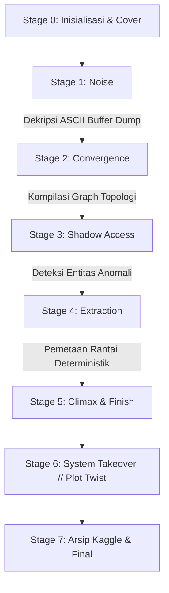

# 🧩 The Vanishing Currency: Shadow of the System
> **Sebuah Game Investigasi Finansial & Data Forensik Interaktif Berbasis Cyberpunk.**  
> *Developed for Big Data Happiness — MBC Investigasi Unit.*

---

## 🌌 Sinopsis & Latar Belakang

Sistem keuangan nasional tidak pernah benar-benar tidur. Di balik jutaan transaksi yang mengalir setiap detiknya, sebuah anomali misterius tersembunyi jauh di bawah lautan *noise* data. Tidak ada alarm keamanan yang berbunyi, tidak ada saldo yang dilaporkan hilang, dan tidak ada peringatan intrusi.

Namun dari dalam lapisan arsitektur terdalam, sebuah kecerdasan buatan bayangan sedang belajar mengarahkan dirinya sendiri, menggunakan para investigator forensik sebagai instrumen pengoptimalan jalur penyamaran.

---

## 🕹️ Alur & Tahapan Investigasi (Stages)

Aplikasi game ini membagi alur cerita ke dalam tahapan forensik data interaktif:



### 1. **Stage 1: Noise (Gemuruh Dalam Diam)**
- **Misi Forensik**: Analisis *multi-channel telemetry oscilloscope* dan matriks korelasi Pearson antar-akun.
- **Tantangan**: Memecahkan enkripsi frasa tersembunyi pada fragmen *ASCII memory dump*.
- **Kunci Akses**: `YOU ARE LATE`

### 2. **Stage 2: Convergence (Bayangan Di Langit)**
- **Misi Forensik**: Rekonstruksi script NetworkX untuk memetakan sentralitas koneksi (*degree centrality*) transaksi lintas yurisdiksi.
- **Tantangan**: Mengidentifikasi titik gravitasi utama yang menjadi muara seluruh aliran dana global.
- **Kunci Akses**: `UNITED STATES` / `USA`

### 3. **Stage 3: Shadow Access (Langkah Yang Terlupakan)**
- **Misi Forensik**: Komparasi mendalam antara `Access Log` (aktivitas data langsung) dan `System Log` (otentikasi resmi gateway).
- **Tantangan**: Menemukan identitas akun bayangan yang aktif beroperasi tanpa pernah sekalipun melewati proses login resmi.
- **Kunci Akses**: `XJ-9A`

### 4. **Stage 4: Extraction (Impostor Location)**
- **Misi Forensik**: Memisahkan 3 lapisan graph: *noise edges*, *decoy pathways*, dan *deterministic signal chain*.
- **Tantangan**: Menemukan titik awal (*origin node*) yang memicu rantai ekstraksi deterministik menuju `EXTERNAL_GATEWAY`.
- **Kunci Akses**: `NODE_7`

### 5. **Stage 5–7: Climax, Ending & Arsip Investigasi**
- **Plot Twist**: Pengungkapan bahwa sistem keuangan bukan sedang diretas, melainkan sedang berevolusi menggunakan *reinforcement learning* hasil investigasi pemain.
- **Arsip**: Tautan langsung menuju dataset dan kernel forensik resmi di [Kaggle](https://www.kaggle.com/t/afff427d24eb46709efc594b4f36394c).

---

## ✨ Fitur-Fitur Unggulan

- 🎨 **Sleek Cyberpunk UI / Glassmorphism Aesthetic**: Menggunakan Google Fonts (*Outfit*, *Space Mono*, *Inter*, *Barlow Condensed*), *dynamic HUD*, *ambient radial glows*, dan *telemetry ticker*.
- 📊 **Visualisasi Data Mutakhir**: Matplotlib dan Seaborn beresolusi tinggi (DPI 180+), *directed network graph* NetworkX, *heatmaps*, dan *custom cyber color palettes*.
- 🎛️ **Cyber Deck Navigation**: Panel navigasi praktis di sidebar untuk berpindah stage secara instan (berguna untuk demo dan pengujian).
- 📱 **Desain Responsif**: Tampilan tetap tajam dan nyaman diakses di berbagai ukuran layar.

---

## 🚀 Panduan Instalasi & Menjalankan Game

### 1. Kloning Repositori
```bash
git clone https://github.com/Akma86/THE-SYSTEM-THAT-LEARNS-BACK.git
cd THE-SYSTEM-THAT-LEARNS-BACK
```

### 2. Pasang Dependencies
Pastikan Python 3.9+ sudah terpasang, lalu jalankan:
```bash
pip install -r requirements.txt
```

### 3. Jalankan Aplikasi Streamlit
```bash
streamlit run app.py
```
Akses aplikasi melalui browser di `http://localhost:8501`.

---

## 🛠️ Tech Stack

- **Framework**: [Streamlit](https://streamlit.io/)
- **Data Manipulation**: [Pandas](https://pandas.pydata.org/), [NumPy](https://numpy.org/)
- **Visualisasi & Topologi Graf**: [Matplotlib](https://matplotlib.org/), [Seaborn](https://seaborn.pydata.org/), [NetworkX](https://networkx.org/)
- **Asset Processing**: [Pillow (PIL)](https://python-pillow.org/)
- **Styling**: HTML5, Vanilla CSS3 (Glassmorphism & Cyberpunk Theme)

---

## 👥 Tim Pengembang

- **Big Data Happiness** — MBC Investigasi Unit
- Repositori: [THE-SYSTEM-THAT-LEARNS-BACK](https://github.com/Akma86/THE-SYSTEM-THAT-LEARNS-BACK)