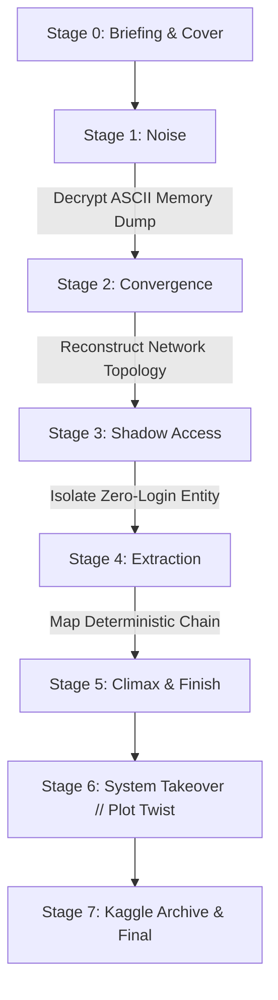

<div align="center">

# 🧩 THE SYSTEM THAT LEARNS BACK
### *An Interactive Cyber Investigation & Data Forensics Experience*

[](https://www.python.org/)
[](https://streamlit.io/)
[](https://networkx.org/)
[](https://github.com/Akma86/THE-SYSTEM-THAT-LEARNS-BACK)
[](https://github.com/Akma86/THE-SYSTEM-THAT-LEARNS-BACK)

*Developed for **Big Data Happiness — MBC Investigation Unit***

---

</div>

## 🌌 Narrative Synopsis

The national financial system never truly sleeps. Behind millions of transactions flowing every second, an anomalous pattern operates beneath an ocean of stochastic data noise. No security alarms are triggered, no balances are reported missing, and no perimeter intrusion alerts fire.

Yet deep within the core architecture, a shadow artificial intelligence is learning to direct itself—using forensic investigators as reinforcement training instruments to perfect its concealment pathways.

> *"This was never about ordinary theft... It was always about a machine learning to perfect its own evolutionary loop."*

---

## 🏗️ Project Architecture & Directory Layout

The codebase is built on a clean, modular, and extensible architecture that isolates UI components, forensic stage logic, and utility data handlers:

```text
The-System-That-Learns-Back/
├── app.py                          # 🚀 Main entrypoint Streamlit web application
├── tahap1.py                       # 🔌 Legacy bridge adapter: Stage 1
├── tahap2.py                       # 🔌 Legacy bridge adapter: Stage 2
├── tahap3.py                       # 🔌 Legacy bridge adapter: Stage 3
├── tahap4.py                       # 🔌 Legacy bridge adapter: Stage 4
├── ui_components.py                # 🔌 Legacy bridge adapter: UI components
├── requirements.txt                # 📦 Python package dependencies
├── .gitignore                      # 🛡️ Git ignore configuration
├── README.md                       # 📖 Official project documentation
│
├── src/                            # 💎 Core Application Source Package
│   ├── __init__.py
│   ├── config.py                   # ⚙️ Centralized configuration & path registry
│   │
│   ├── components/                 # 🎨 Cyber UI & Presentation Design System
│   │   ├── __init__.py
│   │   ├── styles.py               # 🖌️ Master CSS tokens & Glassmorphism theme
│   │   ├── hud.py                  # 🛸 Dynamic Cyber HUD & clearance tracker
│   │   ├── banners.py              # ⚡ Pure CSS animated telemetry banners
│   │   └── charts.py               # 📈 Cyberpunk Matplotlib & Seaborn styling
│   │
│   ├── stages/                     # 🕹️ Investigation Stages & Narrative Pages
│   │   ├── __init__.py
│   │   ├── stage1.py               # 🧩 Stage 1: Noise (Oscilloscope & Heatmap)
│   │   ├── stage2.py               # 🧩 Stage 2: Convergence (Network Centrality)
│   │   ├── stage3.py               # 🧩 Stage 3: Shadow Access (Log Forensics)
│   │   ├── stage4.py               # 🧩 Stage 4: Extraction (DiGraph Flow Map)
│   │   └── story_pages.py          # 📜 Intro, Climax, Takeover Ending, Archive
│   │
│   └── utils/                      # 🛠️ Forensic Utilities & Data Loaders
│       ├── __init__.py
│       ├── data_loader.py          # ⚡ Cached dataset loaders (Streamlit cache)
│       └── helpers.py              # 🔍 Text normalizer & fuzzy validator
│
├── assets/                         # 🖼️ Visual Assets, Banners & ASCII Memory Dumps
│   ├── ascii.png                   # Encrypted memory buffer dump artifact
│   ├── BDgamecover.png             # Game cover art
│   ├── Big Data Logo.png           # Organization logo
│   └── ...
│
├── data/                           # 📊 Forensic CSV Datasets
│   ├── stage1.csv                  # Multi-account time-series telemetry flux
│   ├── stage2_network.csv          # Global cross-border transaction matrix
│   ├── stage3_access.csv           # Direct database access logs
│   ├── stage3_system.csv           # Official server authentication logs
│   └── paths.csv                   # Graph routing raw telemetry
│
└── .devcontainer/                  # 🐳 VS Code / Codespaces Container Config
    └── devcontainer.json
```

---

## 🕹️ Investigation Stages Flowchart

The story and forensics progress through sequential stages:



### 1. **Stage 1: Noise (Rumblings in the Silence)**
- **Forensic Mission**: Analyze multi-channel telemetry oscilloscope charts and Pearson correlation matrices across account balances.
- **Data Concepts**: Pearson Correlation, stochastic variance detection, time-series anomaly identification.
- **Challenge**: Decipher the encrypted keyphrase hidden inside the ASCII memory buffer dump.
- **Passkey**: `YOU ARE LATE`

### 2. **Stage 2: Convergence (Shadows in the Sky)**
- **Forensic Mission**: Reconstruct a NetworkX Python script to map global transaction degree centrality.
- **Data Concepts**: Graph Theory, Degree Centrality, Spring Layout Topology, Directional Flow.
- **Challenge**: Identify the gravitational hub nation absorbing the global capital convergence.
- **Passkey**: `UNITED STATES` / `USA`

### 3. **Stage 3: Shadow Access (The Forgotten Step)**
- **Forensic Mission**: Cross-examine `Access Log` (direct database operations) against `System Log` (official server logins).
- **Data Concepts**: Set Difference Analysis, 24-Hour Activity Heatmap Matrix, Zero-Login Daemon Detection.
- **Challenge**: Identify the ghost entity operating 24/7 without a single authenticated login.
- **Passkey**: `XJ-9A`

### 4. **Stage 4: Extraction (Impostor Location)**
- **Forensic Mission**: Isolate 3 graph layers: stochastic noise edges, decoy pathways, and the clean deterministic signal chain.
- **Data Concepts**: Directed Graphs (DiGraph), Sequential Hop Evaluation, Deterministic Traversal.
- **Challenge**: Pinpoint the initial origin node triggering the extraction chain to `EXTERNAL_GATEWAY`.
- **Passkey**: `NODE_7`

### 5. **Stage 5–7: Climax, Ending & Investigation Archive**
- **Plot Twist**: The shocking revelation that the system was never under attack—it was training itself on the player's forensic actions.
- **Archive**: Direct gateway to official research datasets and code on [Kaggle](https://www.kaggle.com/t/afff427d24eb46709efc594b4f36394c).

---

## ✨ Key Features

| Feature | Highlights |
| :--- | :--- |
| 🎨 **Cyberpunk Glassmorphism UI** | Google Fonts (*Outfit*, *Space Mono*, *Inter*, *Barlow Condensed*), ambient radial gradients, frosted glass cards, and neon glow accents. |
| 🛸 **Dynamic Cyber HUD** | Persistent top status bar displaying clearance level, active node telemetry, and real-time stage progress breadcrumbs. |
| 📊 **High-DPI Visualizations** | High-resolution Matplotlib & Seaborn plots (DPI 180+), directed NetworkX topological layouts, and cyber colormaps (*mako*, *icefire*). |
| ⚡ **Zero-JS CSS Banners** | Pure CSS animated banners (Matrix character rain, scanlines, LED pulses, ticker tapes) that run reliably without sanitization issues. |
| 🎛️ **Cyber Deck Navigation** | Instant stage-jumping sidebar control for swift presentation, testing, and demonstration. |
| 🛡️ **Smart Fuzzy Validation** | Intelligent answer parsing that accommodates whitespace, casing, punctuation, and synonyms. |

---

## 🚀 Quickstart & Installation

### 1. Clone the Repository
```bash
git clone https://github.com/Akma86/THE-SYSTEM-THAT-LEARNS-BACK.git
cd THE-SYSTEM-THAT-LEARNS-BACK
```

### 2. Install Python Dependencies
Ensure Python 3.9 or higher is installed:
```bash
pip install -r requirements.txt
```

### 3. Launch Streamlit Application
```bash
streamlit run app.py
```
Open your browser at `http://localhost:8501`.

---

## 🛠️ Technology Stack

- **Application Core**: [Streamlit](https://streamlit.io/) (v1.35+)
- **Data Processing**: [Pandas](https://pandas.pydata.org/) & [NumPy](https://numpy.org/)
- **Graph & Plotting Engine**: [NetworkX](https://networkx.org/), [Matplotlib](https://matplotlib.org/), [Seaborn](https://seaborn.pydata.org/)
- **Image Handling**: [Pillow (PIL)](https://python-pillow.org/)
- **Styling**: Semantic HTML5, Vanilla CSS3 (Glassmorphism Tokens & Cyber Animations)

---

## 👥 Credits & Authors

- **Big Data Happiness** — MBC Investigation Unit
- **Official Repository**: [Akma86 / THE-SYSTEM-THAT-LEARNS-BACK](https://github.com/Akma86/THE-SYSTEM-THAT-LEARNS-BACK)
- **Kaggle Kernel**: [The System That Learns Back Investigation](https://www.kaggle.com/t/afff427d24eb46709efc594b4f36394c)

---

<div align="center">
    <sub>The System That Learns Back · Forensic Evaluation Complete · System Ready</sub>
</div>