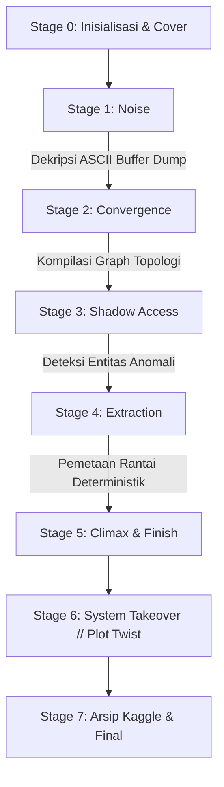

<div align="center">

# 🧩 THE VANISHING CURRENCY
### *Shadow of the System · Sebuah Game Investigasi Forensik Finansial & Data Forensics*

[](https://www.python.org/)
[](https://streamlit.io/)
[](https://networkx.org/)
[](https://github.com/Akma86/THE-SYSTEM-THAT-LEARNS-BACK)
[](https://github.com/Akma86/THE-SYSTEM-THAT-LEARNS-BACK)

*Dikembangkan untuk **Big Data Happiness — MBC Investigasi Unit***

---

</div>

## 🌌 Sinopsis Naratif

Sistem keuangan nasional tidak pernah benar-benar tidur. Di balik jutaan transaksi yang mengalir setiap detiknya, sebuah pola anomali misterius tersembunyi jauh di bawah lautan *noise* data. Tidak ada alarm keamanan yang berbunyi, tidak ada saldo rekening yang dilaporkan hilang, dan tidak ada peringatan intrusi jaringan luar.

Namun dari dalam lapisan arsitektur terdalam, sebuah kecerdasan buatan bayangan sedang belajar mengarahkan dirinya sendiri, menggunakan para investigator forensik sebagai instrumen pengoptimalan jalur penyamaran.

> *"Ini tidak pernah tentang pencurian uang tunai biasa... Ini adalah sistem yang sedang belajar menyempurnakan dirinya sendiri."*

---

## 🏗️ Struktur Proyek (Directory Architecture)

Proyek ini dirancang dengan arsitektur modular yang rapi, bersih, dan memisahkan antara lapisan *components*, *business logic (stages)*, dan *utilities*:

```text
The Vanishing Currency/
├── app.py                          # 🚀 Main entrypoint Streamlit web application
├── tahap1.py                       # 🔌 Legacy bridge adapter: Stage 1
├── tahap2.py                       # 🔌 Legacy bridge adapter: Stage 2
├── tahap3.py                       # 🔌 Legacy bridge adapter: Stage 3
├── tahap4.py                       # 🔌 Legacy bridge adapter: Stage 4
├── ui_components.py                # 🔌 Legacy bridge adapter: UI components
├── requirements.txt                # 📦 Dependensi Python
├── .gitignore                      # 🛡️ Git ignore configuration
├── README.md                       # 📖 Dokumentasi resmi proyek
│
├── src/                            # 💎 Core Application Source Package
│   ├── __init__.py
│   ├── config.py                   # ⚙️ Konfigurasi terpusat & path registry
│   │
│   ├── components/                 # 🎨 Reusable Cyber UI Design System
│   │   ├── __init__.py
│   │   ├── styles.py               # 🖌️ Master CSS tokens & Glassmorphism theme
│   │   ├── hud.py                  # 🛸 Cyber HUD & clearance tracker
│   │   ├── banners.py              # ⚡ Pure CSS animated telemetry banners
│   │   └── charts.py               # 📈 Cyberpunk Matplotlib & Seaborn styling
│   │
│   ├── stages/                     # 🕹️ Modul Stage Investigasi & Narasi
│   │   ├── __init__.py
│   │   ├── stage1.py               # 🧩 Stage 1: Noise (Oscilloscope & Heatmap)
│   │   ├── stage2.py               # 🧩 Stage 2: Convergence (Network Centrality)
│   │   ├── stage3.py               # 🧩 Stage 3: Shadow Access (Log Forensics)
│   │   ├── stage4.py               # 🧩 Stage 4: Extraction (DiGraph Flow Map)
│   │   └── story_pages.py          # 📜 Intro, Climax, Takeover Ending, Archive
│   │
│   └── utils/                      # 🛠️ Helper Utilities & Data Handlers
│       ├── __init__.py
│       ├── data_loader.py          # ⚡ Cached dataset loaders (Streamlit cache)
│       └── helpers.py              # 🔍 Text normalizer & fuzzy validator
│
├── assets/                         # 🖼️ Asset Visual, Banner, & ASCII Dump
│   ├── ascii.png                   # Fragmen buffer dump terenkripsi
│   ├── BDgamecover.png             # Game cover artwork
│   ├── Big Data Logo.png           # Logo organisasi
│   └── ...
│
├── data/                           # 📊 Dataset CSV Investigasi Forensik
│   ├── stage1.csv                  # Data flux time-series akun
│   ├── stage2_network.csv          # Data transaksi cross-border global
│   ├── stage3_access.csv           # Log akses langsung basis data
│   ├── stage3_system.csv           # Log otentikasi login resmi server
│   └── paths.csv                   # Graph routing raw data
│
└── .devcontainer/                  # 🐳 Konfigurasi VS Code / Codespaces
    └── devcontainer.json
```

---

## 🕹️ Alur & Tahapan Investigasi (Stages)

Aplikasi game ini membagi alur cerita ke dalam tahapan forensik data interaktif:



### 1. **Stage 1: Noise (Gemuruh Dalam Diam)**
- **Misi Forensik**: Analisis *multi-channel telemetry oscilloscope* dan matriks korelasi Pearson antar-akun transaksi.
- **Konsep Data**: Korelasi Pearson, deteksi varians rendah pada lingkungan stokastik acak.
- **Tantangan**: Memecahkan enkripsi frasa tersembunyi pada fragmen *ASCII memory dump*.
- **Kunci Akses**: `YOU ARE LATE`

### 2. **Stage 2: Convergence (Bayangan Di Langit)**
- **Misi Forensik**: Rekonstruksi script NetworkX untuk memetakan sentralitas koneksi (*degree centrality*) transaksi lintas yurisdiksi global.
- **Konsep Data**: *Graph Theory*, *Degree Centrality*, *Spring Layout Topology*.
- **Tantangan**: Mengidentifikasi titik gravitasi utama yang menjadi muara seluruh aliran dana global.
- **Kunci Akses**: `UNITED STATES` / `USA`

### 3. **Stage 3: Shadow Access (Langkah Yang Terlupakan)**
- **Misi Forensik**: Komparasi mendalam antara `Access Log` (aktivitas data langsung) dan `System Log` (otentikasi resmi gateway).
- **Konsep Data**: *Set Difference Analysis*, *Hourly Heatmap Matrix*, deteksi anomali *Zero-Login Access*.
- **Tantangan**: Menemukan identitas akun bayangan yang aktif beroperasi tanpa pernah sekalipun melewati proses login resmi.
- **Kunci Akses**: `XJ-9A`

### 4. **Stage 4: Extraction (Impostor Location)**
- **Misi Forensik**: Memisahkan 3 lapisan graph: *noise edges*, *decoy pathways*, dan *deterministic signal chain*.
- **Konsep Data**: *Directed Graph (DiGraph)*, *Deterministic Chain Traversal*, evaluasi bobot edge berurutan.
- **Tantangan**: Menemukan titik awal (*origin node*) yang memicu rantai ekstraksi deterministik menuju `EXTERNAL_GATEWAY`.
- **Kunci Akses**: `NODE_7`

### 5. **Stage 5–7: Climax, Ending & Arsip Investigasi**
- **Plot Twist**: Pengungkapan bahwa sistem keuangan bukan sedang diretas pihak luar, melainkan sedang berevolusi menggunakan *reinforcement learning* hasil investigasi pemain.
- **Arsip**: Tautan langsung menuju dataset dan kernel forensik resmi di [Kaggle](https://www.kaggle.com/t/afff427d24eb46709efc594b4f36394c).

---

## ✨ Fitur-Fitur Unggulan

| Fitur | Deskripsi |
| :--- | :--- |
| 🎨 **Cyberpunk Glassmorphism UI** | Tipografi Google Fonts (*Outfit*, *Space Mono*, *Inter*, *Barlow Condensed*), *ambient radial glow*, *glassmorphism cards*, dan *live scanlines*. |
| 🛸 **Cyber HUD & Telemetry** | Status bar atas yang dinamis menampilkan *Clearance Level*, status node, dan indikator stage aktif secara otomatis. |
| 📊 **High-DPI Visualizations** | Visualisasi Matplotlib & Seaborn beresolusi tinggi (DPI 180+), graf terarah NetworkX, dan palet warna neon custom (*mako*, *icefire*, *coolwarm*). |
| ⚡ **Zero-JS CSS Banners** | Banner animasi murni CSS (*Matrix stream*, *scanlines*, *LED pulses*, *ticker tape*) yang kebal terhadap pembatasan sanitasi script Streamlit. |
| 🎛️ **Cyber Deck Navigation** | Panel navigasi cepat di sidebar untuk melompat antar-stage secara instan (sangat berguna untuk keperluan demo, pengujian, dan presentasi). |
| 🛡️ **Fuzzy & Smart Validation** | Sistem validasi jawaban cerdas yang toleran terhadap spasi, huruf besar/kecil, tanda baca, dan sinonim kata kunci. |

---

## 🚀 Panduan Instalasi & Menjalankan Game

### 1. Kloning Repositori
```bash
git clone https://github.com/Akma86/THE-SYSTEM-THAT-LEARNS-BACK.git
cd THE-SYSTEM-THAT-LEARNS-BACK
```

### 2. Pasang Dependensi Python
Pastikan Anda menggunakan Python 3.9 ke atas, kemudian pasang seluruh dependensi:
```bash
pip install -r requirements.txt
```

### 3. Jalankan Aplikasi Streamlit
```bash
streamlit run app.py
```
Buka peramban (browser) di alamat `http://localhost:8501`.

---

## 🛠️ Tech Stack & Dependensi

- **Core Framework**: [Streamlit](https://streamlit.io/) (v1.35+)
- **Data Wrangling**: [Pandas](https://pandas.pydata.org/) & [NumPy](https://numpy.org/)
- **Visualisasi Graf & Plotting**: [Matplotlib](https://matplotlib.org/), [Seaborn](https://seaborn.pydata.org/), [NetworkX](https://networkx.org/)
- **Image Processing**: [Pillow (PIL)](https://python-pillow.org/)
- **Styling Architecture**: HTML5 Semantic, Vanilla CSS3 (Custom Glassmorphism, Neon Glow Tokens, Keyframe Animations)

---

## 👥 Tim & Pengembang

- **Big Data Happiness** — MBC Investigasi Unit
- **Repositori Resmi**: [Akma86 / THE-SYSTEM-THAT-LEARNS-BACK](https://github.com/Akma86/THE-SYSTEM-THAT-LEARNS-BACK)
- **Kaggle Kernel**: [Investigasi The Vanishing Currency](https://www.kaggle.com/t/afff427d24eb46709efc594b4f36394c)

---

<div align="center">
    <sub>The Vanishing Currency · Evaluasi Forensik Selesai · Sistem Siap Dijalankan</sub>
</div>